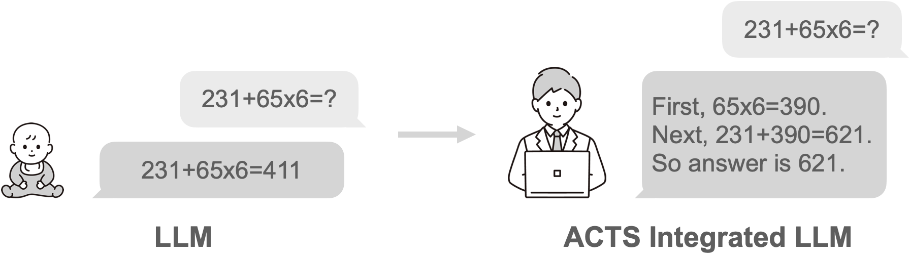

<p align="center">
  
</p>

# MCTS-Integrated Causal LM Generation

<div align="center">


:octocat: [**Github**](https://github.com/Hajime-Y/reasoning-model)  🤗  [**Hugging Face**](https://huggingface.co/collections/HachiML/reasoning-model-675ff6e972e4137892ff396b) 📝  [**Blog**](https://note.com/hatti8/n/n547d03c6a5c9) 🧑‍💻 [**Model**](https://huggingface.co/HachiML/QwQ-CoT-0.5B-JA) 🗂️  [**Data**](https://huggingface.co/datasets/HachiML/OpenMathInstruct-2-CoT-JA)

</div>

#

本プロジェクトでは、Hugging Face Transformersの `AutoModelForCausalLM` を拡張し、Monte Carlo Tree Search (MCTS) を用いたステップごとの探索に基づくテキスト生成を実行します。 これによって、CoTデータセットで学習されたモデルの推論能力を更に向上させます。 
 - `ReasoningModelForCausalLM` はトークン列を直接受け取り、MCTSによる探索を行います。
 - モデルは`.generate`後に、以下を返します。
    - 最終推論結果のトークンリスト
    - 探索した木構造
 - `tree_utils` の `print_tree_with_best_path` を使うと、ツリー構造が選択されたパスと共に可視化できます。

## 🤖 対象モデル
以下のモデルで動くことは確認済み。基本的に、Transformersライブラリの `AutoModelForCausalLM` で動かせるモデルはGGUF含めて動かせるはずです。
 - [HachiML/QwQ-CoT-0.5B-JA](https://huggingface.co/HachiML/QwQ-CoT-0.5B-JA)
 - [Qwen/QwQ-32B-Preview](https://huggingface.co/Qwen/QwQ-32B-Preview)
 - [AIDC-AI/Marco-o1](https://huggingface.co/AIDC-AI/Marco-o1)
 - [Kendamarron/llm-jp-3-3.7b-o1-v0.1](https://huggingface.co/Kendamarron/llm-jp-3-3.7b-o1-v0.1)
 - [Kendamarron/Qwen2.5-7B-o1-ja-v0.1](https://huggingface.co/Kendamarron/Qwen2.5-7B-o1-ja-v0.1)
 - [mmnga/Marco-o1-gguf](https://huggingface.co/mmnga/Marco-o1-gguf)

⚠️ Limitations: 精度向上の確認は、自身で学習させたCoTモデルである [HachiML/QwQ-CoT-0.5B-JA](https://huggingface.co/HachiML/QwQ-CoT-0.5B-JA) でのみ行われています。Marco-o1、QwQ-32B-Previewなどの他のモデルでの精度向上はあくまで保証されません。

## 📝 使い方
### 準備
```
# GitHubリポジトリからクローン
git clone https://github.com/Hajime-Y/reasoning-model.git
cd reasoning-model

# poetry利用
poetry install

# pip利用（非推奨）
pip install transformers torch numpy gguf
```

### パス追加（Google Colab使用時）
```
# Pythonパスにカレントディレクトリを追加
import sys
sys.path.append('.')  # reasoning_model.py と同じディレクトリにいるため
```

### 生成
```
# モジュールのインポート
from reasoning_model import ReasoningModelForCausalLM
from tree_utils import print_tree_with_best_path
from transformers import AutoTokenizer

# tokenizerとmodelの準備
model_name = "HachiML/QwQ-CoT-0.5B-JA"
tokenizer = AutoTokenizer.from_pretrained(model_name)
model = ReasoningModelForCausalLM.from_pretrained(
    model_name,
    torch_dtype="auto",
    device_map="auto"
)

system_prompt = "You are a helpful and harmless assistant. You should think step-by-step."  # 固定を推奨
prompt = "231 + 65*6 = ?"
messages = [
    {"role": "system", "content": system_prompt},
    {"role": "user", "content": prompt}
]

# chat_templateとtokenize
text = tokenizer.apply_chat_template(
    messages,
    tokenize=False,
    add_generation_prompt=True
)
model_inputs = tokenizer([text], return_tensors="pt").to(model.device)

# MCTSを用いて生成（Google ColabのT4インスタンスで1分程度かかる）
final_tokens, final_node = model.generate(
    **model_inputs,
    iterations_per_step=5,      # 1推論ステップの探索に何回シミュレーションを行うか。長いほど精度が高まる可能性はあるが、推論時間が伸びる。
    max_iterations=15,          # 推論ステップの上限: 0.5Bモデルの場合、そこまで長いステップの推論はできないため10~15くらいが妥当。
    mini_step_size=32,          # mini-step: 32tokens。Step as Action戦略を採用する場合、ここを512など大きな数字にする。（実行時間が伸びるため非推奨）
    expand_threshold=0,         # ノードを拡張するために必要なそのノードの訪問回数の閾値。デフォルトの0で、拡張には1回以上の訪問が求められる。基本デフォルトで良い。
    step_separator_ids=None,    # Reasoning Action StrategyでStep as Actionを採用するときの区切りとなるトークンのIDリスト。NoneでモデルConfigの値を利用するため、変更は非推奨。Step as Action不採用時には[]を設定する。
)

# 結果をテキスト化
final_text = tokenizer.decode(final_tokens, skip_special_tokens=True)
print("=== 最終生成テキスト ===")
print(final_text)
```

### ツリー構造の確認
```
# ツリー構造表示
print("=== ツリー構造 ===")
print_tree_with_best_path(final_node, tokenizer)
```

## 使い方(量子化モデル)
通常のTransformersのAutoModelForCausalLMと同様の使い方で、量子化したモデルも利用可能。
以下はGGUFの例。
```
# 使用するモデル名
model_name = "mmnga/Marco-o1-gguf"
file_name = "Marco-o1-Q6_K.gguf"

# Tokenizerの準備
tokenizer = AutoTokenizer.from_pretrained(model_name, gguf_file=file_name)

# モデルの準備
model = ReasoningModelForCausalLM.from_pretrained(model_name, gguf_file=file_name)
```

## 🚨 注意事項
未検証だが、おそらく `Qwen/QwQ-32B-Preview` や `AIDC-AI/Marco-o1` のようなモデルも実行可能。
ただし、これらのモデルはconfigに推論ステップを分割するための`step_separator_ids`が設定されていないため、Step as Actionを採用するときはgenerate実行前にconfigに登録が必要。

```
# step_separator_idsの登録
step_separators = ["\n\n"]
step_separator_ids = [tokenizer.encode(step_separator, add_special_tokens=False)[0] for step_separator in step_separators]
model.config.step_separator_ids = step_separator_ids
```

もしくは、generate時にgenerateにstep_separator_idsを設定する。
```
# 生成時にstep_separator_idsを設定
step_separators = ["\n\n"]
step_separator_ids = [tokenizer.encode(step_separator, add_special_tokens=False)[0] for step_separator in step_separators]

# MCTSを用いて生成
final_tokens, final_node = model.generate(
    **model_inputs,
    step_separator_ids=step_separator_ids,
)
```

## 🙏 I NEED YOUR CONTRIBUTION

本プロジェクトは実験的な段階にあり、改善のためのフィードバックやContributionを募集中です！
気になったことがあれば、IssueやPull Requestをお気軽にお寄せください🙌
